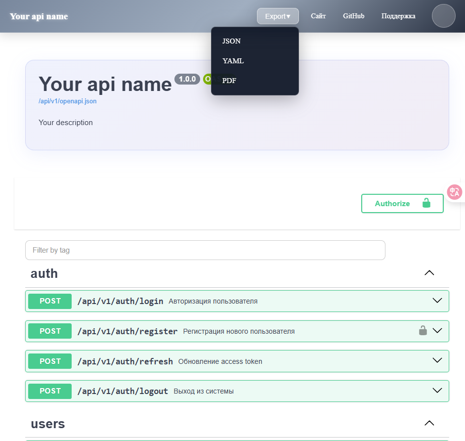

# Plantilla personalizada de Swagger UI

[🇬🇧 English](README.md) | [🇷🇺 Русский](README_ru.md) | [🇪🇸 Español](README_es.md)

Plantilla para personalizar la interfaz estándar de Swagger UI. Esta plantilla reemplaza la barra superior predeterminada con una personalizada y con marca, además de añadir funciones como exportación de la especificación API, modo oscuro y microinteracciones mejoradas.




## ✨ Funcionalidades

* **Barra superior personalizada con marca**: agrega fácilmente el logotipo de tu empresa, enlaces personalizados e información de contacto.
* **Exportación de especificaciones API**: botones para exportar la definición de la API en formatos `JSON` y `YAML`.
* **Modo oscuro**: un tema oscuro moderno para toda la interfaz, conmutado por el usuario.
* **Diseño adaptable**: la interfaz es totalmente responsiva y funciona en dispositivos móviles.
* **Microinteracciones mejoradas**: animaciones fluidas, efectos de onda en los botones y un botón para volver arriba, mejorando la experiencia del usuario.
* **Integración sencilla**: solo necesitas incluir los archivos CSS y JavaScript en tu configuración existente de Swagger UI.

## 🚀 Comenzando

### Requisitos previos

Necesitas tener una instancia funcional de Swagger UI. Esta plantilla está diseñada para superponerse sobre la versión estándar de Swagger UI.

### Instalación

1. Clona este repositorio o descarga los archivos.
2. Copia los siguientes archivos en el directorio de recursos estáticos de tu servidor web donde está alojado Swagger UI:

   * `custom-swagger.css`
   * `custom-swagger.js`
   * `swagger_custom.css`
   * `swagger_custom.js`

### Uso

En tu archivo HTML que carga Swagger UI, incluye los archivos CSS y JavaScript personalizados. Asegúrate de cargarlos **después** de los archivos oficiales de Swagger UI.

```html
<!DOCTYPE html>
<html lang="es">
<head>
    <meta charset="UTF-8">
    <title>Documentación de mi API</title>
    <!-- CSS estándar de Swagger UI -->
    <link rel="stylesheet" type="text/css" href="https://unpkg.com/swagger-ui-dist@3/swagger-ui.css">

    <!-- CSS personalizado -->
    <link rel="stylesheet" type="text/css" href="/static/custom-swagger.css">
    <link rel="stylesheet" type="text/css" href="/static/swagger_custom.css">
</head>

<body>
    <div id="swagger-ui"></div>

    <!-- JavaScript estándar de Swagger UI -->
    <script src="https://unpkg.com/swagger-ui-dist@3/swagger-ui-bundle.js"></script>
    <script src="https://unpkg.com/swagger-ui-dist@3/swagger-ui-standalone-preset.js"></script>

    <script>
    window.onload = function() {
      const ui = SwaggerUIBundle({
        url: "https://petstore.swagger.io/v2/swagger.json",
        dom_id: '#swagger-ui',
        deepLinking: true,
        presets: [
          SwaggerUIBundle.presets.apis,
          SwaggerUIStandalonePreset
        ],
        plugins: [
          SwaggerUIBundle.plugins.DownloadUrl
        ],
        layout: "StandaloneLayout"
      })
      window.ui = ui
    }
    </script>

    <!-- JavaScript personalizado -->
    <script src="/static/custom-swagger.js"></script>
    <script src="/static/swagger_custom.js"></script>
</body>
</html>
```

## 🔧 Configuración

Puedes personalizar la barra superior editando `custom-swagger.js`.

* **Logotipo y enlaces**: busca la función `createBlueStrip` y modifica la constante `stripHTML` para cambiar el logotipo, enlaces y texto.
* **Nombres de archivos exportados**: puedes cambiar los nombres predeterminados en el atributo `download` de las etiquetas `<a>` dentro de `stripHTML`.

Los estilos se pueden modificar en `custom-swagger.css` y `swagger_custom.css`.

## 📂 Estructura de archivos

* `custom-swagger.js`: maneja la creación de la barra superior personalizada y sus elementos.
* `custom-swagger.css`: contiene los estilos para la barra superior personalizada.
* `swagger_custom.js`: incluye la lógica para funciones avanzadas como cambio de tema, microinteracciones y el botón de volver arriba.
* `swagger_custom.css`: contiene los estilos para el tema oscuro, diseño adaptable y otras mejoras de UI.

## 🤝 Contribuciones

¡Las contribuciones son bienvenidas! No dudes en enviar un Pull Request.

## 📄 Licencia

Este proyecto está licenciado bajo la licencia MIT. Consulta el archivo [LICENSE.md](LICENSE.md) para más detalles.
